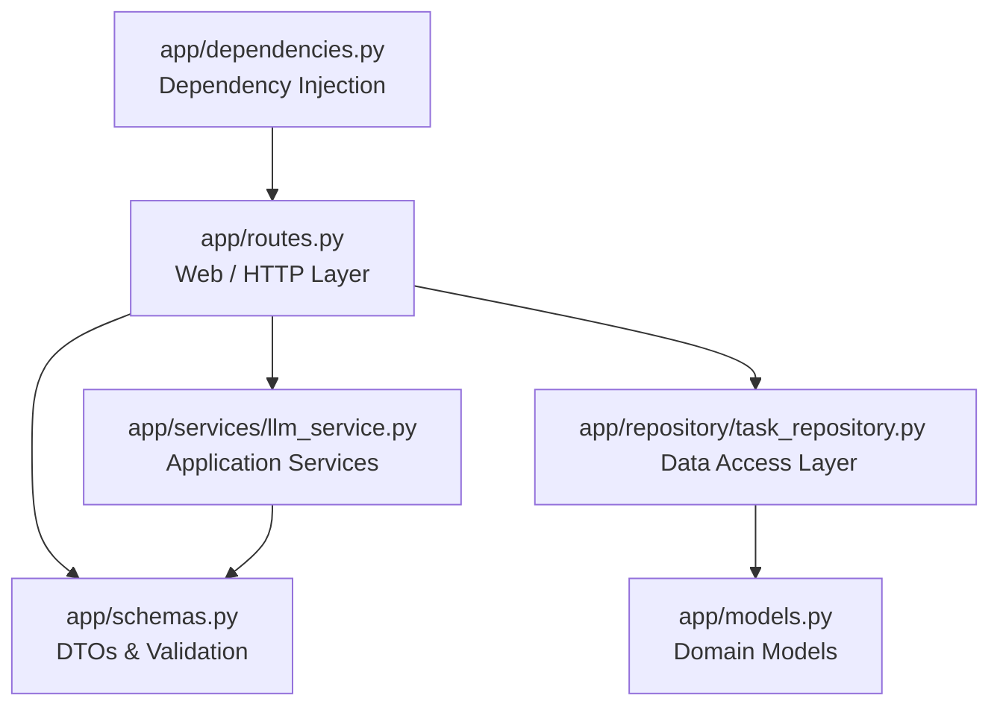
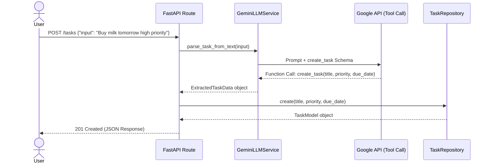

# System Architecture: AI-Powered Task Assistant

This document outlines the architectural design, component responsibilities, and data flow of the AI-Powered Task Assistant API.

## 1. High-Level Overview

The system is built as a **FastAPI** web application following a strict **Domain-Driven Design (DDD)** and **Clean Architecture** pattern. This ensures that the web layer, business logic, external integrations (LLMs), and data storage are fully decoupled.

### Core Technologies
- **Framework:** FastAPI (Python 3.12+)
- **Validation:** Pydantic V2
- **LLM Integration:** Google GenAI SDK (Gemini 2.5/3.0+ via Tool Calling)
- **Dependency Injection:** FastAPI `Depends` for component wiring
- **Testing:** Pytest with HTTPX (`TestClient`)

## 2. Component Layers

The application is structured into four primary layers, ensuring a unidirectional dependency flow:

### 2.1 The Domain Layer (`app/models.py`, `app/schemas.py`)
- **`app/models.py`:** Contains raw Python dataclasses (e.g., `TaskModel`). This is the absolute core of the domain and depends on nothing else.
- **`app/schemas.py`:** Contains Pydantic V2 models. These act as Data Transfer Objects (DTOs) for incoming HTTP requests, outgoing HTTP responses, and strict validation of data extracted by the LLM.

### 2.2 The Service Layer (`app/services/llm_service.py`)
This layer encapsulates the complex business logic of talking to AI models.
- **`BaseLLMService`:** An abstract protocol defining the contract `parse_task_from_text()`. This ensures the rest of the application doesn't care *which* LLM vendor is used.
- **`GeminiLLMService`:** The concrete implementation that talks to Google's Gemini API using **Automatic Function Calling (Tool Calling)**. It passes a JSON Schema of a task and forces the LLM to return structured data rather than free-form text.
- **`MockLLMService`:** A deterministic, offline implementation used exclusively for unit and integration testing.

### 2.3 The Repository Layer (`app/repository/task_repository.py`)
Abstracts away the database.
- Currently implements an in-memory dictionary store for rapid prototyping.
- Exposes standard CRUD operations (`create`, `get_all`, `get_by_id`, `update`, `delete`).
- The rest of the app doesn't know it's in-memory; it can be seamlessly swapped for a PostgreSQL (SQLAlchemy) repository in the future without changing a single line of API routing code.

### 2.4 The Web/API Layer (`app/routes.py`, `app/main.py`)
- **`app/routes.py`:** Defines the RESTful HTTP endpoints (`GET`, `POST`, `PUT`, `DELETE`). It strictly handles HTTP concerns (status codes, path parameters) and delegates all business logic to the injected Repository and Service. It contains **zero LLM vendor SDK imports**.
- **`app/main.py`:** The entry point. Initializes FastAPI, registers the routers, and attaches global exception handlers.
- **`app/dependencies.py`:** Wires the application together using Dependency Injection. It provides the singleton instances of the Repository and decides whether to inject the `GeminiLLMService` or `MockLLMService` based on environment variables.

## 3. Data Flow (Creating a Task via AI)

When a user sends a natural language string to the API, the following sequence occurs:

## 4. Error Handling Strategy

Errors are caught at the lowest level possible and translated into domain exceptions, which are then caught globally by FastAPI to return standardized HTTP responses.

- **`InvalidTaskInputError` (HTTP 400):** Raised by the `LLMService` when the user sends gibberish (e.g., "hello world") or when the LLM explicitly calls the `reject_task` tool.
- **`RequestValidationError` (HTTP 422):** Automatically raised by Pydantic when HTTP path parameters or JSON bodies are malformed.
- **`LLMServiceError` (HTTP 502):** Raised when the Google API times out, hits rate limits, or returns an unparseable response. This shields the user from internal stack traces and correctly blames the upstream gateway.

## 5. Testing Strategy

The architecture is explicitly designed for high testability:

1. **Integration Tests (`tests/test_tasks.py`):** Tests the FastAPI routes, HTTP status codes, and repository logic. It relies on FastAPI's `dependency_overrides` to inject the `MockLLMService`. This makes the tests run in milliseconds, cost $0, and guarantees 100% determinism (no LLM hallucinations).
2. **LLM Unit Tests (`tests/test_llm.py`):** Tests the `GeminiLLMService` in isolation by mocking the underlying Google GenAI network client. It verifies that tool calls are correctly parsed into Enums and Date objects, and that missing fields fall back to safe defaults.
